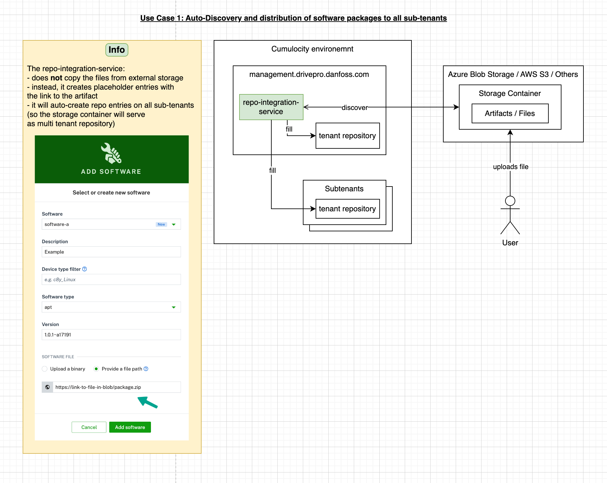
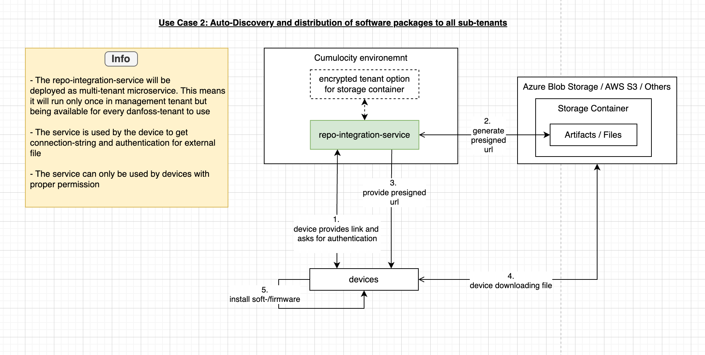

# Attention / Disclaimer

This repository is **work in progress**. It is not ready to use yet. 

# About

A repository to integrate the Cumulocity Repositories with an AWS storage account. 

It will support two use cases:

1. Automatically sync artifacts from an external storage to the tenant and all its sub-tenants

2. Generate and provide presigned URLs to Devices

