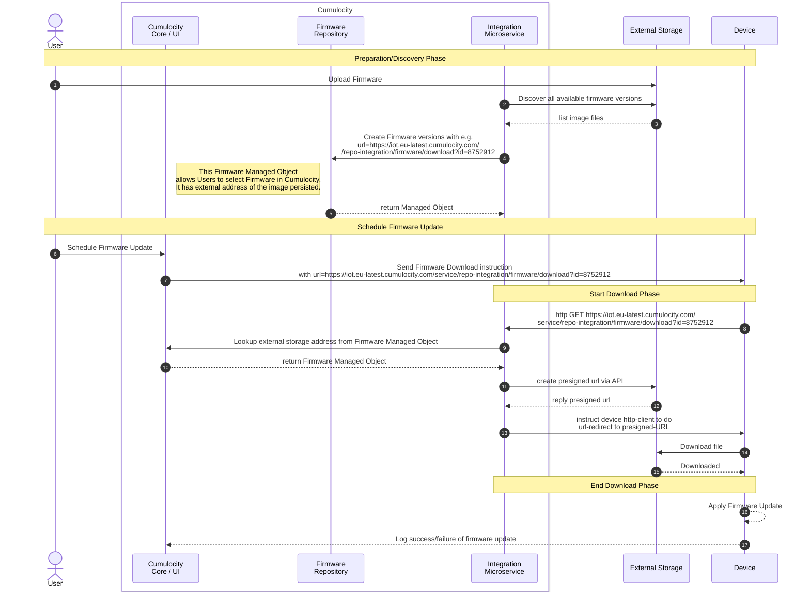

# Attention / Disclaimer

This repository is **work in progress**. It is not ready to use yet. 

# About

A repository to integrate the Cumulocity Firmware Repository with an AWS storage account. The service supports:

* Discovering firmware images stored in an S3 bucket. These images will be synchronized with Cumulocitys Firmware Repositories. It does *not* copy the actual Files to the Cumulocity repository, it works with URLs instead. 

* It exposes an endpoint to download the firmware images. 

See below sequence diagram for details:

# Configuration

Service can be configured with the below tenant options:

Category | Key | Value
--|--|--|
repo-integration-fw | awsConnectionDetails | '{"region": "{aws region}", "secretAccessKey": "{aws access secret}", "accessKeyID": "{aws access key}", "bucketName": "{bucket name}" }'

# Next steps

* Supporting Azure Blob storage

* Next to firmware, also support software-repository