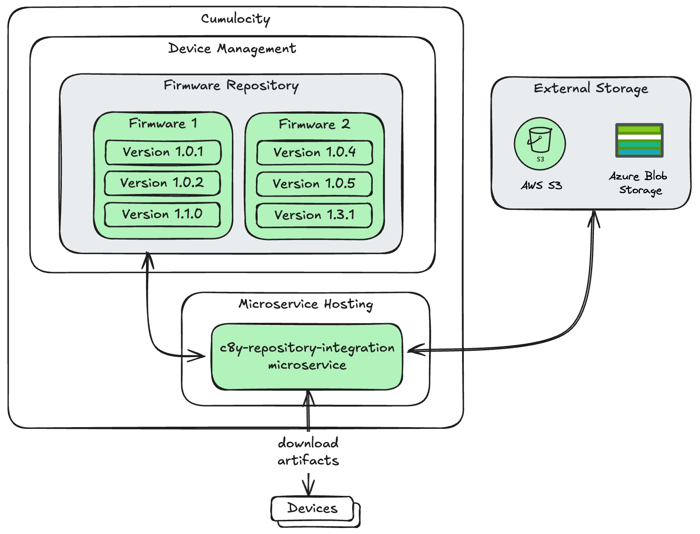

# About

A repository to integrate the Cumulocity Firmware Repository with an AWS storage account. The service supports:

* Discovering firmware images stored in an external cloud storage (AWS S3, Azure Blobs). These images will be synchronized with Cumulocitys Firmware Repositories. It does *not* copy the actual Files to the Cumulocity repository, it works with URLs instead.

* It exposes an endpoint to download the firmware images. The devices sending their requests to the Cumulocity Microservice, which redirects the request to a (presigned) URL to the external solution.



# Sequence Diagram 

See below sequence diagram to get an overview how the service works:


# Service Configuration

Service can be configured with the below tenant options:

Category | Key | Value | Note
--|--|--|--|
repoIntegrationFirmware | storageProvider | "awsS3" or "azblob" | Supported values: `awsS3`, `azblob`. Datatype string. |
repoIntegrationFirmware | awsS3ConnectionDetails | '{"region": "\<aws region\>", "secretAccessKey": "\<aws access secret\>", "accessKeyID": "\<aws access key\>", "bucketName": "\<bucket name\>" }' | Mandatory if storageProvider = `awsS3`. Value is a stringified JSON. |
repoIntegrationFirmware | azBlobConnectionDetails | '{"connectionString": "\<Connection string of your azure storage container\>", "containerName": "\<container name\>" }' | Mandatory if storageProvider = `azblob`. Value is a stringified JSON. |

# Upload a new Firmware to your storage account

For checking the available Firmware Versions, the Service expects two Files to be present in the root of your referenced storage solution:

* `c8y-firmware-info.json`:

```text
Filename: c8y-firmware-info.json
About: In this file you're describing details about each firmware (not the version) using the fields:
* name: The name of your firmware. Mandatory.
* description: A description about your firmware. Mandatory.
* deviceType: The deviceType of your Cumulocity Devices where this firmware is applicable to. Optional.

File Content (sample):
------------------------
{"name": "my firmware 1", "description": "Description for firmware 1", "deviceType": "thin-edge.io"}
{"name": "my firmware 2", "description": "Description for firmware 2", "deviceType": "thin-edge.io"}
{"name": "my firmware 3", "description": "Description for firmware 3"}
```

* `c8y-firmware-version.json`:

```text
Filename: c8y-firmware-version.json
About: In this file you're describing details about each firmware version using the fields:
* key: the file location inside your external storage solution. Mandatory.
* name: the firmware name of this version (needs to match with the name-field in c8y-firmware-info.json). Mandatory.
* version: the firmware version. Mandatory.

File Content (sample):
------------------------
{"key": "my-firmware-1_1.0.1.zip", "name": "my firmware 1", "version": "1.0.1"}
{"key": "my-firmware-1_1.0.2.zip", "name": "my firmware 1", "version": "1.0.2"}
{"key": "my-firmware-2_1.0.1.zip", "name": "my firmware 2", "version": "1.0.1"}
{"key": "my-folder-1/my-firmware-3_1.0.1.zip", "name": "my firmware 3", "version": "1.0.1"}
```

The Microservice periodically checks these two files. Once they changed it is starting the synchronization towards Cumulocity. The created firmware objects in Cumulocity will have the fragment `externalResourceOrigin`, the `c8y_Firmware.url` field will be a link towards this Microservice with `id` being the Managed Object ID of the Firmware object. 


# Download File

Each synchronized firmware version has a URL that points towards this Microservice (this is the URL that also Devices will receive). To download the file, the client/device needs to send a GET to this auto-generated URL, e.g.:

* via curl (with basic auth):
```sh
$ curl -sL -o "YourfileName.zip" -u '${cumulocityTenantId}/${CumulocityUserName}:${CumulocityPassword}' -X 'GET' 'https://kb.latest.stage.c8y.io/service/dm-repo-integration/firmware/download?id=9963218'
```

* via curl (with OAI token): 
```sh
$ curl -k -o "YourfileName.zip" -H 'Authorization: Bearer ${CumulocityOAIToken}' -X 'GET' 'https://kb.latest.stage.c8y.io/service/dm-repo-integration/firmware/download?id=9963218'
```

* via thin-edge using the in-built [Cumulocity Proxy](https://thin-edge.github.io/thin-edge.io/references/cumulocity-proxy/):
```sh
# Either with 'tedge http' command (introduced with thin-edge.io version 1.5.0)
$ tedge http get "/c8y/service/dm-repo-integration/firmware/download?id=9963218" > YourFileName.zip

# Or doing a curl against the local proxy
$ curl -sL -o "YourFileName.zip" "http://127.0.0.1:8001/c8y/service/dm-repo-integration/firmware/download?id=3161253"
```

# Multi-Tenancy

Service runs in multi-tenancy mode by default. This enables you having a "multi-tenant repository" where the artifacts are only stored once on the external storage and auto-synced to every Tenant that is subscribed to this Service.

# Roadmap

* Supporting firmware patches (for now, create a new version for patching)

* Next to firmware-, also support software-repository
